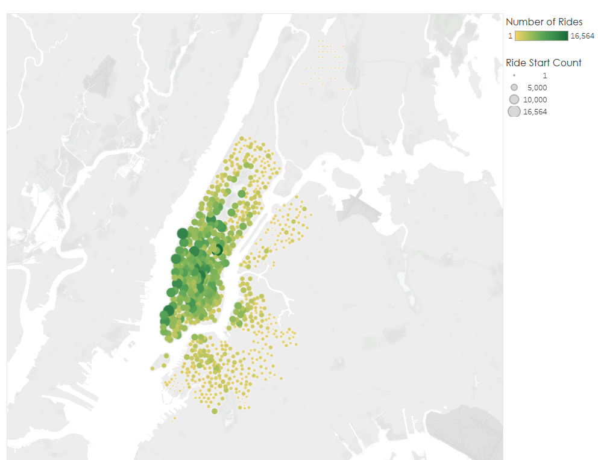
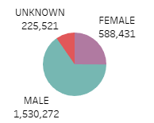
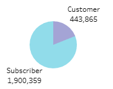
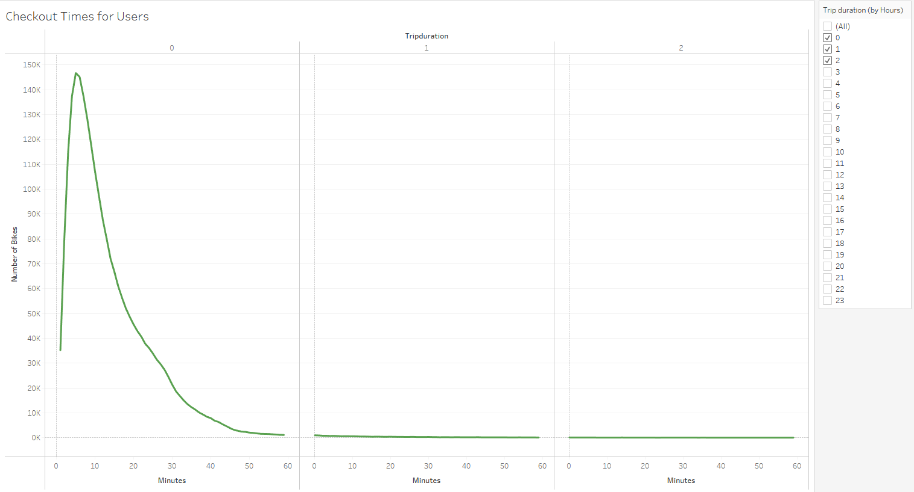
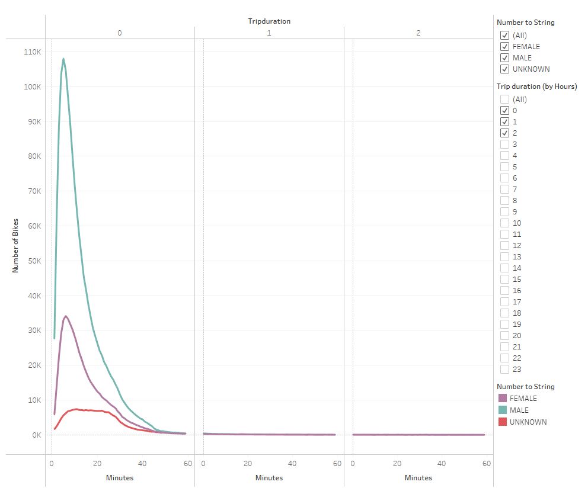
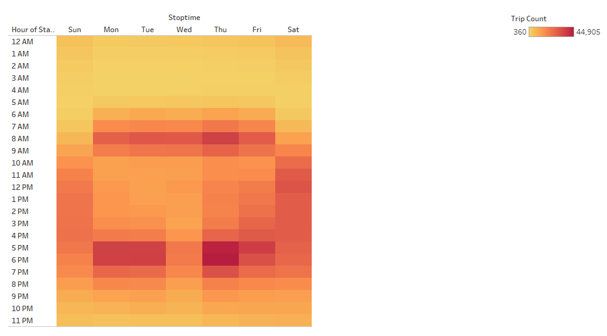
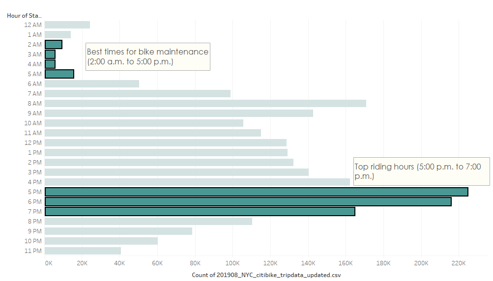
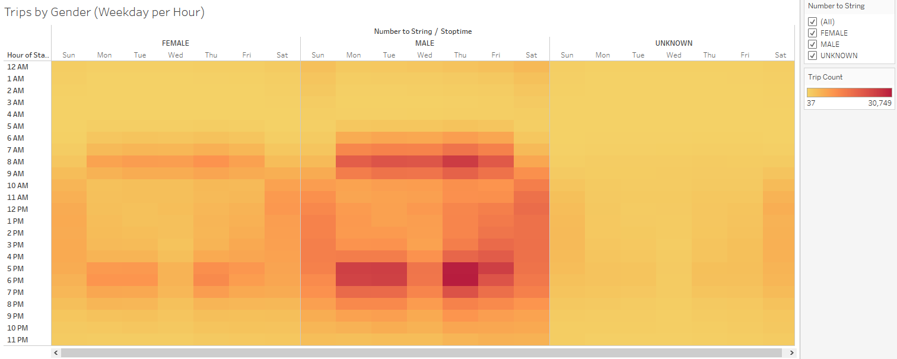
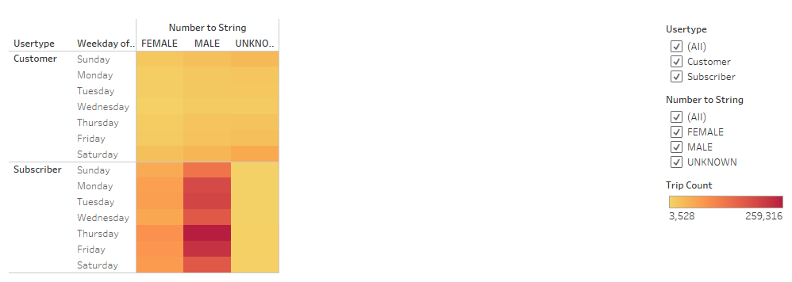

# Bikesharing

## Overview
Utilizing results from New York City’s Citi bike sharing program data from 2019, we are investigating whether the similar concept of a bike company would be feasible to implement in the city of Des Moines, Iowa. While both cities are distinct in terms of geographical locations and features, comparing the participation of the bike sharing program can assist in proving if a company to establish a similar program could be equally as fruitful in Iowa. There are already angel investors inquiring about the business proposition and are intrigued to see an analysis of the results. 

The data used for this analysis derives from information collected from August 2019, in which August represents the summer month with the busiest traffic. Essentially, through the use of Tableau, we have created a variety of charts and graphs to better understand not only how the business actually works in NYC, but analyze the participation to create a proposal as to how the bike-sharing program may work in Des Moines. 

## Tech Used:
- Python
- Pandas
- Tableau

## Dataset:
- Citi Bike System August 2019 Data

## Objectives: 
- Import data into Tableau.
- Create and style worksheets, dashboards, and stories in Tableau.
- Use Tableau worksheets to display data in a professional way.
- Portray data accurately using Tableau dashboards.

## Results
Keeping in mind that Des Moines and New York City are two different makeups of cities, the information collected from New York City’s bike sharing participation can shed some light as to the breakdown of individuals who are more inclined to use a bike-sharing program.

Understanding when and where people use Citi Bike will help to determine where to best pilot the program in Des Moines. The above symbol map depicts the most popular locations in the city for starting a bike journey. The larger and darker shade of green on the map signifies the most popular stations that bike riders are more inclined to start at. Viewing the location of popularity, we can tell it is in the central hub of the city. 

While we know that the data compromises of 2,344, 224 total number of trips, we want to see a breakdown by gender of who and how many are taking the trips in the program. We can see that about 1 million more males participate in the program more than females, with a small portion of the users are categorized as ‘unknown’. 

As we break down the data further, we want to further view how the user type of Citi Bike is organized. Through the pie chart, we can see that annual subscribers far outpace the customer group (these individuals who only hold a 24-hour pass or a 3-day pass user). Preference wise, users are more inclined to hold an annual pass for the use of the bike rather than purchase the program type for a few day time frame, expressing a desire of a longer term commitment with the program rather than having a a few days access.

As we understand the sub groups who participate in the program, we move on to understanding the length of times that bikes are checked out. Viewing the line chart, we see that having the bike checked out for not even an hour is a popular choice, roughly 146k of rides have bikes checked out for about 5 minutes. Showing that in the city with shorter distances, the most favorite way to get across is by bike. 

Now breaking down the length of checked out bikes by gender, males are shown to check out bikes more and heavily represent the group that checks out bikes no more than roughly 5-10 minute timeframe. 

Shifting to the heat map, this depicts the number of bike trips taken each weekday measured by every hour of the day. We are able to see that on the days of Monday, Tuesday, Thursday, and Friday, the bike sharing program sees the highest amount of bike trips taken between 5pm to 7pm. Which roughly correlates to the time that people are leaving their workplaces for the day and commuting back. Both Saturday and Sundays show a high amount of bike usage from around 10am to 7pm. Even on the weekends individuals are taking an active use in Citi Bikes. 

This bar chart delineates in a different way the popularity of Citi Bikes for the total number of trips to be between 5 pm to 7 pm, while the least operational times are from 2am to 5am. In this timeframe in the morning, while bike utilization is at its lowest, the bike sharing company should take advantage to repair any needed bikes in time before the day begins. It is inevitable that bikes will need repairs and maintenance, and doing these repairs in a time slot that does not see much user activity is key to make sure that all bikes can be available to be used during the day. 

As we dive deeper to viewing the number of bike trips taken daily per hour by gender, we recognize that while males participate more in the program, they tend to utilize the Citi Bikes more during 6am to 9am and 5pm to 7pm. This correlates to the notion that these are the timeframe that oversees the highest commuting intervals. For females, we can see that they are used the most around the 6am-9am and 5pm to 7pm timeframes as well; however, not as much as the males.

Now we created a heat map to view which user types, customer or subscriber, show an increase usage during the week between the gender groups. Analyzing the map, we can conclude that males are the group who are primarily subscribers and record the highest number of rides for all seven days of the week. Females who are subscribers tend to utilize the Citi Bikes more Thursday through Saturday. 

## Summary

In the city that never sleeps and where life is fast-paced from morning to night, Citi Bikes have proven to be a popular and reliable commuting program for its users. Where traffic can get high due by the car, bus, or even train system, having the option of a bike system has shown that individuals are willing to sign up annually to participate in the bike sharing program as an alternate mode of transportation. 

Through the visualization of different charts and maps with our data, males were the highest participating group in the bike sharing program, with their participation being heavily present in the morning and evening times coinciding the workday commutes. It would be interesting to see how to increase female participation in the program at some point. However, the data overall concludes that the bike sharing program has proven to be successful.

Taking this analysis a step further, there are two suggested visualizations that can be explored at a later time. One would be a visualization comparing birth year and user type, understanding which individuals by age group are the ones most likely to subscribe to be customers of a daily or 3-day pass versus annual members of the bike sharing program. Maybe there is one group to focus on more to increase the bike sharing program exposure to or understand how to attract the attention of other age ranges depending on their birth year. 

It is also worth exploring the start and end locations of the stations to determine which ones are most popular for participants to understand the bike utilization of that area and if it is worth increasing the Citi Bikes available to see if there is an uptick in consumer usage with more bike available. 
